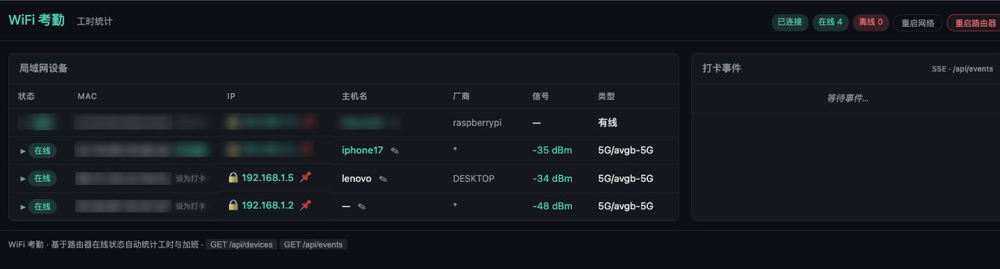
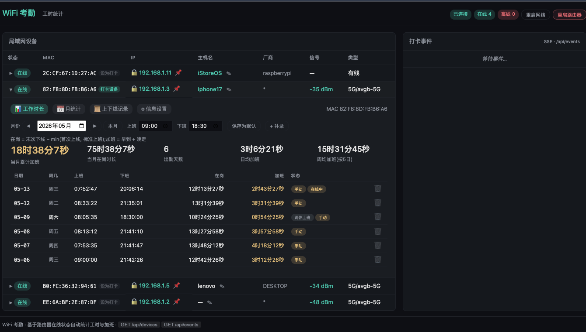
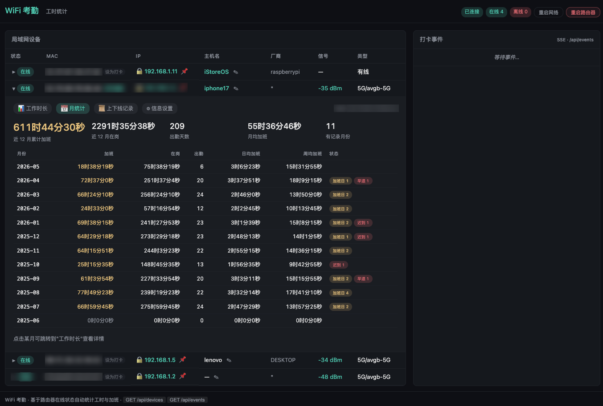

# argus-app

[](https://github.com/xxl6097/argus-app/actions/workflows/ci.yml)
[](https://github.com/xxl6097/argus-app/releases)
[](LICENSE)
[](go.mod)

基于 [argusd](https://github.com/xxl6097/argusd) 的 OpenWrt 设备监控工具，
在原有 WiFi 上下线探测能力之上扩展了一套面向**个人考勤 / 加班统计**的 Web 仪表板。
路由器把 WiFi 上线时间当作"打卡"，离线当作"下班"，自动算出每天的在岗时长、加班时长、迟到 / 早退状态，
按月汇总并推送到 Webhook / ntfy。

> 名字虽叫 `argus-app`，仪表板上的对外标题已经改成了 **WiFi 考勤 · 工时统计**。

## 目录

- [界面截图](#界面截图)
- [快速开始](#快速开始)
- [安装教程](#安装教程)
  - [一、确认架构](#一确认架构)
  - [二、下载发行包](#二下载发行包)
  - [三、安装到系统目录](#三安装到系统目录)
  - [四、启动并设置开机自启](#四启动并设置开机自启)
  - [五、首次配置](#五首次配置)
  - [六、升级与卸载](#六升级与卸载)
  - [七、故障排查](#七故障排查)
- [设计目标](#设计目标)
- [项目结构](#项目结构)
- [后端能力](#后端能力)
- [Web UI 功能](#web-ui-功能)
- [安装与部署](#安装与部署)
- [HTTP API 一览](#http-api-一览)
- [开发约定](#开发约定)
- [许可](#许可)

## 界面截图

<div align="center">
  
  <br>
  
  <br>
  
</div>

> 截图缺失？在 [`docs/screenshots/`](docs/screenshots/README.md) 里看命名规范并提交你的实机截图。

## 快速开始

### 方式 0：一键脚本（最简）

直接 SSH 到 OpenWrt 路由器执行：

```sh
wget -O- https://github.com/xxl6097/argus-app/releases/latest/download/install.sh | sh
```

或：

```sh
curl -fsSL https://github.com/xxl6097/argus-app/releases/latest/download/install.sh | sh
```

**国内 GitHub 直连不通时**，下面三条任选一条，**安装脚本自己后续会再走加速镜像下载二进制**：

```sh
# 首选 — jsDelivr (CloudFlare CDN, 走仓库 main 分支)
wget -O- https://cdn.jsdelivr.net/gh/xxl6097/argus-app@main/install.sh | sh

# 备选 — gh-proxy.com (走 GitHub Releases, 拿到的就是 latest 版本)
wget -O- https://gh-proxy.com/https://github.com/xxl6097/argus-app/releases/latest/download/install.sh | sh

# 备选 — gh-proxy 走 raw (不依赖 Release 是否发布)
wget -O- https://gh-proxy.com/https://raw.githubusercontent.com/xxl6097/argus-app/main/install.sh | sh
```

脚本会自动识别架构、下载对应包、校验 SHA256、安装 init 脚本、启用开机自启并启动服务。**直连 GitHub 失败时会自动回退到内置加速镜像列表**，国内环境也能一行搞定。常用环境变量：

```sh
# 指定版本（默认拉 latest）
VERSION=v0.1.0 sh install.sh

# 改监听端口
PORT=18099 sh install.sh

# 强制走某个加速前缀（默认是先直连，失败自动 fallback 到内置镜像）
PROXY=https://gh-proxy.com sh install.sh

# 强制只走 GitHub 直连（适合海外服务器）
PROXY=none sh install.sh

# 自定义镜像列表（空格分隔，按顺序回退）
GH_MIRRORS="https://your.mirror https://another.mirror" sh install.sh

# 强制覆盖已有 init 脚本（默认升级时只换二进制）
FORCE=1 sh install.sh
```

### 方式 A：下载预编译二进制（手动）

到 [Releases](https://github.com/xxl6097/argus-app/releases) 下载对应架构的压缩包，
里面包含 `argus-app` 可执行文件 + OpenWrt init 脚本 + 部署文档：

```bash
# 以 aarch64（MT7981/高通 etc.）为例
wget https://github.com/xxl6097/argus-app/releases/latest/download/argus-app_vX.Y.Z_linux_arm64.tar.gz
tar xzf argus-app_vX.Y.Z_linux_arm64.tar.gz
scp argus-app/argus-app root@192.168.1.1:/usr/bin/argus-app
scp argus-app/packaging/openwrt/argus-app.init root@192.168.1.1:/etc/init.d/argus-app
ssh root@192.168.1.1 'chmod +x /usr/bin/argus-app /etc/init.d/argus-app && /etc/init.d/argus-app enable && /etc/init.d/argus-app start'
```

浏览器访问 `http://192.168.1.1:9099` 即可。完整步骤见 [packaging/openwrt/README.md](packaging/openwrt/README.md)。

### 方式 B：从源码构建

见下面 [安装与部署](#安装与部署) 一节的 `buildAndUpRun.sh` 脚本。

## 安装教程

完整的从零到运行流程，针对预编译 release 包。

### 一、确认架构

SSH 到路由器，运行：

```bash
uname -m
```

对应关系：

| `uname -m` 输出 | 应下载的包 | 典型设备 |
|---|---|---|
| `aarch64` | `linux_arm64` | MT7981、IPQ60xx、RK3568 等 ARM64 路由 |
| `armv7l` | `linux_armv7` | MT7621、Raspberry Pi 2/3、老款 ARMv7 |
| `mips` | `linux_mips_softfloat` | 大端 MIPS（部分老款联发科） |
| `mipsel` 或 `mips64el` | `linux_mipsle_softfloat` | 小端 MIPS（MT7620/MT7628 等） |
| `x86_64` | `linux_amd64` | x86 软路由（J4125、N5105、N100 等） |

> 拿不准时打 `aarch64` 包试一下，跑不起来再换。

### 二、下载发行包

到 [Releases](https://github.com/xxl6097/argus-app/releases/latest) 找到对应架构的 `.tar.gz`。

**方式 1：从你的电脑下载并 scp 上传**（推荐，路由器存储紧）

```bash
# 本机执行
TAG=v0.1.0   # 替换成最新 tag
ARCH=arm64   # 替换成你的架构
wget "https://github.com/xxl6097/argus-app/releases/download/${TAG}/argus-app_${TAG}_linux_${ARCH}.tar.gz"

tar xzf argus-app_${TAG}_linux_${ARCH}.tar.gz
scp argus-app/argus-app          root@192.168.1.1:/tmp/
scp argus-app/packaging/openwrt/argus-app.init root@192.168.1.1:/tmp/argus-app.init
```

**方式 2：路由器直接下载**（仅适用 OpenWrt 自带 wget-ssl 且有公网）

```bash
# 路由器上执行
cd /tmp
TAG=v0.1.0
ARCH=arm64
wget "https://github.com/xxl6097/argus-app/releases/download/${TAG}/argus-app_${TAG}_linux_${ARCH}.tar.gz"
tar xzf argus-app_${TAG}_linux_${ARCH}.tar.gz
cd argus-app
```

### 三、安装到系统目录

SSH 到路由器后：

```bash
# 二进制
install -m 0755 /tmp/argus-app /usr/bin/argus-app
# 或上面方式 2 走这一行：
# install -m 0755 /tmp/argus-app/argus-app /usr/bin/argus-app

# init 脚本
install -m 0755 /tmp/argus-app.init /etc/init.d/argus-app
# 或上面方式 2：
# install -m 0755 /tmp/argus-app/packaging/openwrt/argus-app.init /etc/init.d/argus-app

# 数据目录（持久化 JSON 都在这里）
mkdir -p /etc/argus-app /etc/argus-app/history
```

校验一下：

```bash
argus-app -version
# 输出形如：argus-app v0.1.0 (commit abc1234, built 2026-05-14T...)
```

### 四、启动并设置开机自启

```bash
/etc/init.d/argus-app enable    # 开机自启
/etc/init.d/argus-app start     # 立即启动

# 查看状态
/etc/init.d/argus-app status
pidof argus-app
logread | grep argus-app | tail -20
```

成功后浏览器访问 `http://<路由器 IP>:9099`，例如 `http://192.168.1.1:9099`。

> **想改监听端口或参数？** 编辑 `/etc/init.d/argus-app`，修改 `LISTEN=` 或 `procd_set_param command` 那一段后 `/etc/init.d/argus-app restart`。

### 五、首次配置

1. **首次登录**：浏览器访问 `http://<路由器 IP>:9099`，被重定向到 `/login`。默认账号 `admin / admin`，登录后强制改密；新密码至少 6 位。后续在右上角 ⚙ 「设置 → 账户」 里随时改密 / 退出。
2. **设置工作时间**：右上角 ⚙ 「设置」 → 不在这里，标准工时入口仍在打卡设备的「工作时长」 tab → 「设置」 按钮 → 填写 `work_start` / `work_end`，保存。
3. **挑选打卡设备**：在主表里点设备行最右的「**设为打卡**」 徽章，把你常用的手机 / 笔记本加为打卡设备。
4. **重命名设备**（可选）：每行「✎」 按钮起一个易记名字（`iphone17`、`work-laptop`），后续所有持久化文件都会用别名做 key，比 MAC 友好。
5. **配置全局 Webhook**（可选）：⚙ 「设置 → 全局通知 Webhook」 填一条 URL，**任何设备**上下线都会推一份过去（payload 带 `scope:"global"`），适合「全屋设备总线」 这种监控。
6. **配置每设备通知**（可选）：进入设备详情 → 「⚙ 信息设置」 tab，填 Webhook / ntfy 服务器，保存即生效；与全局 webhook 并行触发，不互相替代。
7. **设静态 IP**（可选）：每行 IP 旁边「📌」 按钮 → 弹窗勾「立即生效」 可以瞬断一次让设备拿到新 IP。
8. **导出备份**（可选）：⚙ 「设置 → 备份与恢复」 → 「📦 导出全部数据」 一键下载 `argus-app-backup-<时间戳>.tar.gz`，部署到新路由器后用同一个面板的「📥 从备份恢复」 还原。

### 六、升级与卸载

**升级（推荐：UI 一键升级）**：

仪表板右上角的版本徽章 (`v0.1.x`) 会在后台轮询 GitHub Releases，发现新版会变橙并加 🆙 标记。点击徽章 → 「立即升级」，路由器会自己下载、替换二进制、重启服务，整个过程 30–60 秒，期间页面短暂不可用。

**升级（手动）**：

```bash
/etc/init.d/argus-app stop
install -m 0755 /tmp/argus-app /usr/bin/argus-app
/etc/init.d/argus-app start
# /etc/argus-app/ 下的数据无需任何处理，新版自动兼容旧格式
```

**卸载**（保留数据）：

```bash
/etc/init.d/argus-app stop
/etc/init.d/argus-app disable
rm /usr/bin/argus-app /etc/init.d/argus-app
```

**彻底清除**（含数据）：

```bash
rm -rf /etc/argus-app
```

### 七、故障排查

| 现象 | 检查方向 |
|---|---|
| 启动后 `pidof argus-app` 为空 | `logread | tail -30` 看错误；常见是端口被占用或架构不匹配（`-bash: ./argus-app: cannot execute binary file`） |
| 浏览器打不开 9099 | 防火墙是否拦截 LAN：`uci show firewall | grep input`；或换个端口 |
| 上下线不刷新 | 本工具依赖 [argusd](https://github.com/xxl6097/argusd) 的探测能力，确认路由器有可用数据源（`hostapd-cli` / `dhcp.leases` 至少一种） |
| 工时一直是 0 | 「设置」里 `work_start` / `work_end` 有没有保存？设备是否加入打卡集合？数据目录 `/etc/argus-app/history/` 是否可写？ |
| 节假日不更新 | 路由器是否能访问 `timor.tech`？`logread | grep -i holiday`；可手动在「工作时长」tab 上切换日子类型作为应急 |
| 通知没收到 | `/api/notifications/test` 触发一次合成事件，看 webhook 服务端 / ntfy 客户端有无收到；URL 是否带协议前缀 `https://` |

---

## 设计目标

- **单文件部署**：纯 Go，零外部依赖（HTML 嵌入二进制）。CGO 关闭，交叉编译到 ARM64
  跑在主流 OpenWrt 路由器上（MT7981、ipq60xx 等）。
- **零侵入**：不动路由器原生功能。所有持久化都在 `/etc/argus-app/*.json` 单独管理。
- **Web UI 自带登录**：cookie session + bcrypt，首次启动播种 `admin/admin`，强制改密。
- **自治**：每天凌晨从公开 API 拉取国家法定节假日，省下手工维护。
- **在线升级**：仪表板可直接探测最新 release 并触发自我升级，无需 SSH。
- **数据可携**：⚙ 系统设置里一键导出 `/etc/argus-app` 全量备份, 一键恢复到新路由器。

---

## 项目结构

```
argus-app/
├── cmd/app/main.go                  # 入口 + 命令行参数
├── interval/web/
│   ├── server.go                    # HTTP / SSE / 路由总线
│   ├── credentials.go               # bcrypt 登录凭据 + session 存储
│   ├── version.go                   # GitHub Releases 探测 + 自升级触发
│   ├── backup.go                    # /etc/argus-app 数据目录 tar.gz 打包/解包
│   ├── backup_handlers.go           # /api/backup/export | /api/backup/import
│   ├── aliases.go                   # MAC → 友好名 持久化
│   ├── dhcp.go                      # OpenWrt uci 静态 IP 管理
│   ├── system.go                    # 重启网络 / 重启路由器
│   ├── history.go                   # 上下线历史 + 工时计算核心
│   ├── settings.go                  # 打卡设备 + 标准工时 + 全局 Webhook
│   ├── overrides.go                 # 按月嵌套的 (alias, date) 手动工时覆写
│   ├── holidays.go                  # 双层节假日存储 + timor.tech 自动拉取
│   ├── notify.go                    # 每设备 Webhook + ntfy 推送 / 订阅
│   ├── assets/dashboard.html        # 单文件 Web UI（vanilla JS + EventSource）
│   └── assets/login.html            # 登录页（含强制改密流程）
├── packaging/openwrt/argus-app.init # procd init 脚本
├── install.sh                       # 一键安装脚本（带镜像回退）
├── buildAndUpRun.sh                 # 交叉编译 + 上传 + 启动 一键脚本
└── go.mod
```

---

## 后端能力

### 1. 设备探测（来自 argusd）
- 自动选择数据源：`ahsapd` / `dhcp.leases` / `arp` 等
- 每秒轮询，cooldown / 抖动抑制
- 监听 OpenWrt syslog 捕获 `MAC表新增 / 无线接入 / 认证完成 / DHCP分配` 等底层事件

### 2. MAC 别名 (`aliases.json`)
为某 MAC 起易记名字（如 `iphone17`、`lenovo`），仪表板以及内部存储均优先使用别名。

### 3. 静态 IP 管理（DHCP）
通过 OpenWrt `uci` 写 `dhcp` 段：
- 设静态 IP / 修改 / 移除
- 可选「立即生效」：`wifi reload` 让设备瞬断重连，新 IP 即刻拿到
- 冲突检测：同一 IP 已属于其他 MAC 时弹替换确认

### 4. 上下线历史 (`history/<mac>.jsonl`)
每个 MAC 一份 JSONL 追加日志，记录 ONLINE / OFFLINE 事件。
- **保留 30 天**，超出阈值自动压缩
- 启动时把当前在线设备播种为 ONLINE，避免长期无事件丢上线时点

### 5. 工时统计核心（`history.go`）
按日 (`ComputeWorktime`) / 按月 (`MonthlyReport`) 两套算法。

**日级输出字段**：

| 字段 | 含义 |
|---|---|
| `present_secs` | 在岗时长 = 末次下线 − min(首次上线, 标准上班) |
| `early_ot_secs` | 早到加班 = max(0, 标准上班 − 首次上线) |
| `late_ot_secs` | 晚走加班 = max(0, 末次下线 − 标准下班) |
| `overtime_secs` | 加班时长 = `early_ot + late_ot`（OT 日例外，详见下文） |
| `arrival_status` | `""` / `late` / `missed_in`（迟到 / 漏刷卡） |
| `departure_status` | `""` / `early_leave`（早退） |
| `day_kind` | `workday` / `weekend` / `holiday` / `makeup` / `otday` |
| `ot_day` | 是否「整天算加班」的日子 |
| `manual` | 是否使用了手动 override |
| `missing_out` | 仅有上班记录、没有下班 |

**日子类型与口径**：

| 类型 | 触发 | 加班口径 | 迟到/早退判定 |
|---|---|---|---|
| workday | 工作日（默认） | 早到 + 晚走 | ✅ |
| weekend | 周六/周日（未被调休覆盖） | 整天 | ❌ |
| holiday | 法定节假日（API 推送） | **不算加班** | ❌ |
| makeup | 调休工作日（API 推送 `workday`） | 早到 + 晚走 | ✅ |
| otday | 用户手动标记的工作日加班 | 整天 | ❌ |

**月度聚合**：累计加班 / 累计在岗 / 出勤天数 / 周末加班天数 / 迟到 / 漏刷卡 / 早退 / 日均加班 / 周均加班（按 5 个工作日折算）。

### 6. 标准工时与打卡设备 (`settings.json`)
- 工时窗口：`work_start` / `work_end` 全局共用，支持 HH:MM 与 HH:MM:SS
- 打卡设备：`punch_macs[]` —— 多选，每台设备独立统计

### 7. 手动覆写 (`overrides.json`)
- 当系统漏检（路由器宕机、忘带手机）时手动补录某天的上班/下班时间
- 文件按月嵌套：`{alias: {YYYY-MM: {YYYY-MM-DD: {in, out}}}}`
- 兼容旧扁平结构，启动时自动迁移

### 8. 节假日双层存储 (`holidays.json` + `holidays_system.json`)
- **手动层**（`holidays.json`）：UI 中「设为工作日 / 设为加班日 / 设为节假日 / 恢复默认」
- **系统层**（`holidays_system.json`）：从 `timor.tech/api/holiday/year/YYYY` 拉取
  - 启动立即拉一次当前年 + 后续 9 年
  - 之后每天 **03:00 本地时间** 重新拉
  - 单年失败不影响其他年；网络全挂保留旧缓存
  - 中国国务院通常只公布次年节假日，未公布年份自动跳过
- 查询优先级：手动 > 系统 > 周末判定

### 9. 通知派发 (`notifications.json`)
每台设备可独立配置：
- **Webhook**：HTTP(S) 端点，POST 一份 JSON（含结构化字段 + `markdown` 字段）
- **ntfy**：服务器 + 用户名/密码 + req 主题（推送上下线消息）+ res 主题（订阅外部消息）
- res 主题消息保留每设备最近 100 条，UI 实时展示

**消息内容（Markdown）**：
- 打卡设备 ONLINE → 「【alias】上班了」+ 上班时间 + 今日加班 + 本月加班
- 打卡设备 OFFLINE → 「【alias】下班了」+ 下班时间 + 今日加班 + 本月加班
- 普通设备 → 「【alias】上线啦 / 下线啦」+ 设备 / IP / MAC / 时间

### 10. 全局 Webhook（`settings.json`）
独立于每设备 webhook 的「**全屋总线**」：在 ⚙ 设置中填一条 URL，**任何**设备的 ONLINE/OFFLINE 都额外推一份过去；payload 多带一个 `scope` 字段（`"global"` vs `"device"`），方便消费端区分两种来源、避免重复处理。每设备 webhook + 全局 webhook 同时生效, 互不替代。

### 11. Web UI 登录（`credentials.json`）
- **bcrypt + cookie session**：首次启动播种 `admin / admin` 并标记 `must_change`，登录后强制改密；密码不少于 6 位
- 文件强制 `0600`，保存的是 bcrypt 哈希（cost=10），明文密码不落盘
- 服务端 session 存于内存（24 小时 TTL），改密后所有其它会话失效
- 路径置空（`-credentials=""`）禁用登录闸刀，仅供本地开发

### 12. 在线升级（GitHub Releases）
- 后台轮询 `api.github.com/.../releases/latest`（30 分钟缓存，失败回退到 `gh-proxy.com`）
- 仪表板版本徽章自动比对 semver，发现新版变橙 + 🆙
- 「立即升级」 → 服务器写一条 bootstrap 脚本，detach 后通过 `setsid` 运行 `install.sh`，整个 `procd` 服务自我停-换-启
- `Cache-Control: no-cache` + ETag 保证升级后页面不读到旧 HTML

### 13. 数据备份与恢复（`/api/backup/*`）
- `GET /api/backup/export` 流式打包整个 `-data-dir` 为 `tar.gz`，含 `manifest.json` (`format` / `format_version` / `exported_at` / `exporter_hostname`)
- `POST /api/backup/import` 接收 multipart 上传：先校验 manifest 与 `format == argus-app-backup`、再两步 rename 原子替换 (失败时自动回滚, 成功后立即清理 .bak)
- 防 zip-slip: 拒绝绝对路径 / `..` / 异常文件类型 (symlink/device/socket); 限 32 MiB 上传 / 16 MiB 单文件 / 100 MiB 解压总量
- 可选「同时恢复账户/凭据」：默认勾选，取消则跳过 `credentials.json` + `notifications.json` 并从 live 目录复制保留
- 凭据被替换时自动 `RevokeAll()` 全员重新登录, 避免 session/hash 不匹配

---

## Web UI 功能

主页面：左栏 = 局域网设备，右栏 = 打卡事件 SSE 流。

### 设备行（每行）
- 状态徽章（在线 / 离线 + 离线时长）
- MAC 字段右侧「**设为打卡 / 打卡设备**」徽章 — 点击即加入 / 移出打卡集合（可多选）
- 主机名 / 别名 + ✎ 内联重命名
- IP 显示 + 🔒 静态租约标记 + 📌 设静态 IP 弹窗
- 整行点击展开**详情面板**

### 详情面板（按 tab 分）

#### 📊 工作时长（仅打卡设备显示）
- 顶部月度汇总卡：累计加班 / 在岗 / 出勤 / 日均加班 / 周均加班
- 中部每日列表：日期 / 周几（按日子类型变色）/ 上班 / 下班 / 在岗 / 加班 / 状态徽章 / 🗑 删除
- 月份 ◀ / ▶ / 「本月」按钮 + 上班/下班时间快速调整 + 「保存为默认」+ 「+ 补录」
- 选中某天后下方展开当日详情卡 + 「手动编辑 / 设为工作日 / 设为加班日 / 设为节假日 / 恢复默认」按钮组
- 节假日 / 周末加班 / 调休 / 手动加班 / 缺下班 / 仍在线等情况会显示带颜色的横条提示
- 日期/月份维度的迟到、漏刷卡、早退会用红字突出

#### 📅 月统计（仅打卡设备显示）
- 近 12 个月一表罗列：月份 / 加班 / 在岗 / 出勤 / 日均加班 / 周均加班 / 状态
- 顶部 5 列汇总：近 12 月累计加班 / 在岗 / 出勤天数 / 月均加班 / 有记录月份数
- 点击任意月份 → 自动跳到「工作时长」tab 并加载该月

#### 📜 上下线记录
- 保留 30 天的上线 / 离线时间线，**单日视图** + 左右键 / ◀ ▶ 按钮翻页
- 显示 IP、主机名等附加字段

#### ⚙ 信息设置
- Webhook 地址输入框
- ntfy：服务器 / 用户名 / 密码 / req 主题 / res 主题
- 「保存」/ 「移除」按钮 + 状态提示
- 下方实时显示 res 主题最近 100 条消息（标题 + 内容）

### 顶部全局按钮
- **版本徽章**：显示当前 `v0.1.x`，发现新版会变橙 + 🆙 提示。点击弹版本 modal，可查看 release notes 并触发 「立即升级」。
- **⚙ 设置**：统一入口，4 个区块：
  - **全局通知 Webhook** —— 任何设备 ONLINE/OFFLINE 都额外推送到这里
  - **账户** —— 修改密码 / 退出登录
  - **系统** —— 重启网络服务（5–15 秒瞬断、保留配置）/ 重启路由器（30–60 秒断网、二次确认）
  - **备份与恢复** —— 一键导出整个 `/etc/argus-app` 为 `tar.gz`，一键导入恢复（导入二级确认: 是否恢复账户/凭据）

---

## 安装与部署

### 1. 准备工作（首次）
- 路由器：OpenWrt 21.02+，aarch64 / armv7 / x86_64，开启 SSH
- 本机：Go 1.25+，`sshpass`（macOS：`brew install hudochenkov/sshpass/sshpass`）

### 2. 一键脚本

```bash
./buildAndUpRun.sh
```

可通过环境变量覆盖默认值：

```bash
ROUTER_HOST=192.168.1.1 \
ROUTER_USER=root \
ROUTER_PASS='your-pass' \
ROUTER_PORT=22 \
LISTEN_ADDR=0.0.0.0:9099 \
GO_BIN=/usr/local/go/bin/go \
./buildAndUpRun.sh
```

脚本流程：
1. `CGO_ENABLED=0 GOOS=linux GOARCH=arm64 go build` 交叉编译
2. SSH 到路由器：`killall argus-app`
3. SCP 上传 `/tmp/argus-app`
4. 后台启动：`nohup /tmp/argus-app -listen=0.0.0.0:9099 ... &`

### 3. 命令行参数

| 参数 | 默认值 | 说明 |
|---|---|---|
| `-listen` | `""`（关闭 Web UI） | Web 监听地址，例 `0.0.0.0:9099` |
| `-data-dir` | `/etc/argus-app` | 数据根目录，`/api/backup/export\|import` 以此为源 |
| `-credentials` | `/etc/argus-app/credentials.json` | 登录凭据（bcrypt 哈希 + 用户名）；置空禁用登录 |
| `-aliases` | `/etc/argus-app/aliases.json` | MAC 别名存储 |
| `-settings` | `/etc/argus-app/settings.json` | 打卡设备 + 标准工时 + 全局 Webhook |
| `-overrides` | `/etc/argus-app/overrides.json` | 手动工时覆写（按月嵌套） |
| `-notifications` | `/etc/argus-app/notifications.json` | Webhook / ntfy 配置 |
| `-holidays` | `/etc/argus-app/holidays.json` | 用户手动节假日（不被自动刷新触碰） |
| `-holidays-system` | `/etc/argus-app/holidays_system.json` | 自动拉取的节假日缓存 |
| `-holidays-years` | `10` | 拉取年数（当年 + 未来 N−1） |
| `-history-dir` | `/etc/argus-app/history` | 上下线历史目录 |

任意路径置空（`-foo=""`）即禁用对应功能。

### 4. 信号

| 信号 | 行为 |
|---|---|
| SIGINT / SIGTERM | 优雅退出 |
| SIGHUP | 重启 Watcher（保留 known / cooldown） |
| SIGUSR1 | 打印 metrics 快照到 stderr |

### 5. 环境变量
- `ARGUSD_DEBUG=1` — 开启 slog Debug + 决策 trace

---

## HTTP API 一览

| 路径 | 方法 | 用途 |
|---|---|---|
| `/` | GET | 嵌入式仪表板（未登录跳 `/login`） |
| `/login` | GET | 登录页 |
| `/api/login` | POST | 用户名/密码 → 写 session cookie |
| `/api/logout` | POST | 销毁当前 session |
| `/api/password` | POST | 修改密码（要求当前密码 + 新密码）；成功后 RevokeAll |
| `/api/version` | GET | 当前二进制版本（version / commit / date / upgrade_open） |
| `/api/version/check` | GET | 探测 GitHub Releases 最新版（`?force=1` 跳缓存） |
| `/api/upgrade` | POST | 触发自升级，可选 `{"version":"vX.Y.Z"}` 否则取 latest |
| `/api/devices` | GET | 当前设备 + 离线缓存 |
| `/api/events` | GET (SSE) | 上下线 / Change 事件流 |
| `/api/aliases` | GET / POST / DELETE | MAC 别名增删改查 |
| `/api/dhcp` | GET / POST / DELETE | 静态 IP 租约 |
| `/api/history` | GET | 某 MAC 上下线记录（最多 30 天，可加 `from=YYYY-MM-DD&to=YYYY-MM-DD` 取单日） |
| `/api/worktime` | GET | 单日工时报告 |
| `/api/worktime/month` | GET | 月度工时报告 |
| `/api/worktime/override` | GET / POST / DELETE | 手动覆写 |
| `/api/settings` | GET / POST / DELETE | 打卡设备 + 标准工时 + 全局 Webhook |
| `/api/holidays` | GET / POST / DELETE | 合并视图（手动 + 系统）|
| `/api/notifications` | GET / POST / DELETE | 每设备 Webhook / ntfy 配置 |
| `/api/notifications/messages` | GET | res 主题最近消息 |
| `/api/notifications/test` | POST | 触发一次合成事件用于调试 |
| `/api/backup/export` | GET | 流式下载 `/etc/argus-app` 全量备份 (`tar.gz`) |
| `/api/backup/import` | POST | multipart 上传备份并恢复，可选 `restore_credentials` |
| `/api/system/reboot` | POST | 重启路由器 |
| `/api/system/restart-network` | POST | 重启网络服务 |

除 `/login` / `/api/login` / `/favicon.ico` 外的所有路由均要求有效 session cookie；写操作（POST / DELETE）目前不再做 LAN 来源限制，由登录闸刀负责身份验证。

---

## 开发约定

- 所有时间显示统一为 24 小时制 `HH:MM:SS`，时长统一为 `H时M分S秒` 或紧凑 `1h7m13s`
- 日期解析使用 `ParseInLocation(..., time.Local)` 避免 UTC 偏移
- 持久化文件使用「写临时文件 + 原子 rename」保证 crash 安全
- 别名重命名后，旧的 MAC-keyed 条目在下一次写入时自动迁移到 alias key

## 许可

MIT
